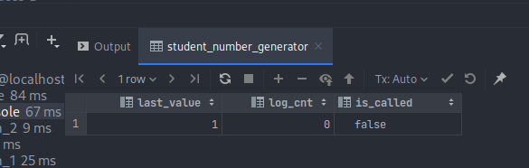
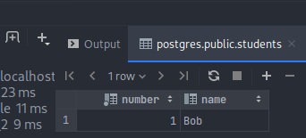
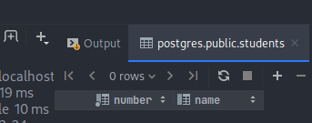
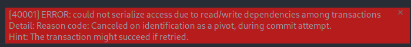
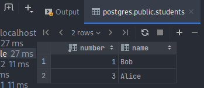

# PostgreSQL Isolation (not for all data types)

## Running PostgreSQL
We have used PostgreSQL's docker image available
[here](https://hub.docker.com/_/postgres/). The following command launches
PostgreSQL and  makes it available at [localhost:5432](localhost:5432) with
username `postgres`, and password `mysecretpassword`.
```bash
$ ./scripts/launch_postgres
```


## Sequences

In PostgreSQL, sequences are objects used to generate sequences of integers.
Sequences are created with the `CREATE SEQUENCE` statement. This creates and
initializes a new single-row table called `number_generator` which can be
observed with a simple `SELECT` query. For example:

```sql
CREATE SEQUENCE student_number_generator;
SELECT * from student_number_generator;
```



From [PostgreSQL
documentation](https://www.postgresql.org/docs/current/functions-sequence.html)
we can see that sequences have the following operations:
- `nextval ( regclass ) → bigint` - Advances the sequence object to its next
  value and returns that value. This is done atomically: even if multiple
  sessions execute `nextval` concurrently, each will safely receive a distinct
  sequence value.
- `setval ( regclass, bigint [, boolean ] ) → bigint` - Sets the sequence
  object's current value, and optionally its `is_called` flag. The two-parameter
  form sets the sequence's `last_value` field to the specified value and sets
  its `is_called` field to true, meaning that the next `nextval` will advance
  the sequence before returning a value. 
- `currval ( regclass ) → bigint` - Returns the value most recently obtained by
  `nextval` for this sequence in the current session.
- `lastval () → bigint` - Returns the value most recently returned by `nextval`
  in the current session. 

## Serial

Sequences can also be used to create an auto incrementing unique identifiers in
a table. Considering our previously created sequence, we could this by executing
the following:

```sql
CREATE TABLE students (
    number INT NOT NULL DEFAULT NEXTVAL('student_number_generator'), 
    name VARCHAR(90)
);

-- Or if we dont want to use the student_number_generator sequence:
CREATE TABLE students (
    number SERIAL, 
    name VARCHAR(90)
);
```

From here, we can insert students omitting the `number` column or alternatively,
by using the `DEFAULT` keyword:
```sql
 INSERT INTO students (name) VALUES ('Bob');
 INSERT INTO students VALUES (DEFAULT, 'Alice');
```

**NOTE:** 
- `SERIAL` columns are not unique by default, you have to specify `UNIQUE` or
  `PRIMARY KEY` explicitly if you want the `SERIAL` column to be unique.
- The `NULL` value cannot be inserted into a `SERIAL` column.


## Sequences and Isolation Levels

Changes to sequences are made immediately visible to all running sessions
despite isolation levels, and in order to avoid blocking transactions reading
from the same sequence, a `NEXTVAL` operation is never rolled back. With this in
mind, we can see that sequences may have gaps due transaction rollbacks. In
order to observe this, please consider the following example in which **T1** and
**T2** run concurrently.


**Creating the database:**
```sql
DROP TABLE  students;

CREATE TABLE students (
    number SERIAL, 
    name VARCHAR(90)
);
```

**T1:**
```sql
BEGIN TRANSACTION ISOLATION LEVEL SERIALIZABLE;

INSERT INTO students (name) VALUES ('Bob');
SELECT * from students

COMMIT;
```

**T2:**
```sql
BEGIN TRANSACTION ISOLATION LEVEL SERIALIZABLE;

SELECT * FROM students
INSERT INTO students (name) VALUES ('Alice');
SELECT * FROM students

COMMIT;
```

Let's say that the schedule is as follows:

1. **T1** starts with the serializable isolation level;
2. **T2** starts with the serializable isolation level;
3. **T1** inserts Bob into the `students` table using the sequence
   `student_number_generator`;
4. **T1** reads the table `students` observing that Bob was inserted with
   `number` equal to 1; 
5. **T2** reads the table `students` observing that it is still empty because of
   isolation; 
6. **T2** inserts Alice into the `students` table using the sequence
   `student_number_generator`;
7. **T2** reads the table `students` observing that Alice was inserted with
   `number` equal to 2; 
8. **T1** successfully commits 
9.  **T2** tries to commit, but fails and rolls back.
    

In such a scenario, the table `students` will have Bob's tuple but not Alice's.
Moreover, if we try to add Alice now, we will observe that she is inserted with
`numer` equal to 3, since the sequence associated with the `SERIAL` datatype was
not rolled back with **T2**.



In the end, what we can take from this is that isolation is violated, and also
that rollbacks might not discard all transaction changes whenever sequences are
used, which is not what we would expect at first.

## Useful Links
- [PostgreSQL's Sequence Manipulation Functions](https://www.postgresql.org/docs/current/functions-sequence.html);
- [PostgreSQL - SERIAL - Generate IDs (Identity, Auto-increment)](https://sqlines.com/postgresql/datatypes/serial).
